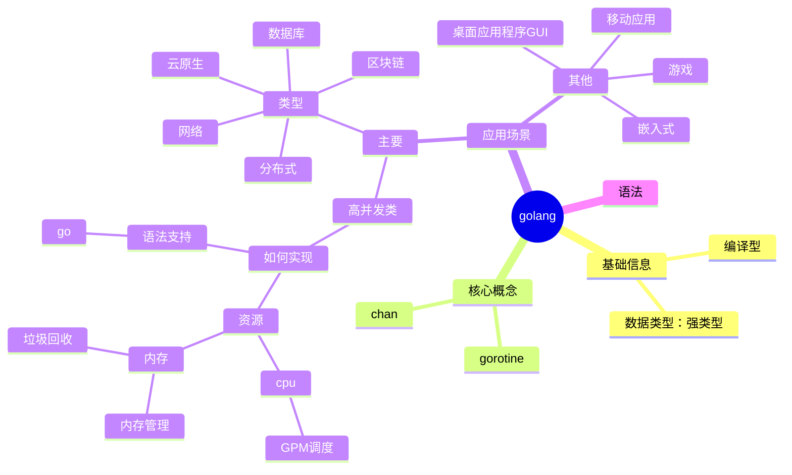

```mermaid
mindmap
  root((golang))
    基础信息
        编译型
        数据类型：强类型
    核心概念
      gorotine
      chan
    应用场景
        主要
            高并发类
                如何实现
                    资源
                      cpu
                         GPM调度
                      内存
                        内存管理
                        垃圾回收
                    语法支持
                      go
            类型
              网络
              分布式
              云原生
              区块链
              数据库              
        其他
          游戏
          桌面应用程序GUI
          嵌入式
          移动应用
    语法
```
